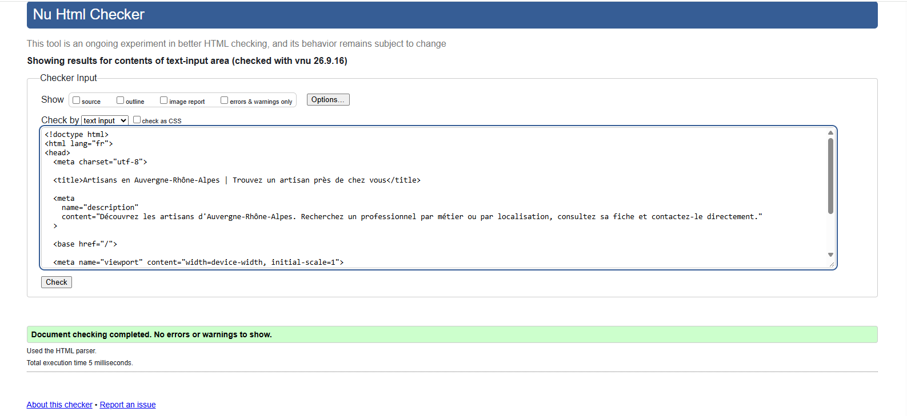
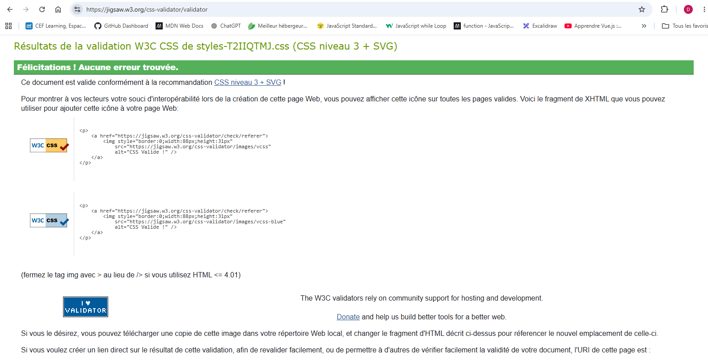
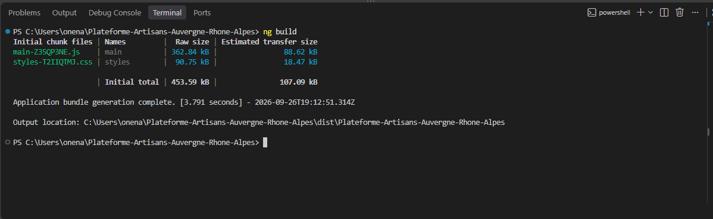

# Plateforme Artisans Auvergne-Rhône-Alpes

Application web permettant de rechercher et de découvrir des artisans de la région Auvergne-Rhône-Alpes.

Ce projet a été réalisé dans le cadre de ma formation de développeur web à partir d'un cahier des charges et de maquettes conçues sur Figma.

## Déploiement

L'application est déployée sur Render.

### Frontend

L'application Angular est accessible en production à l'adresse :

https://plateforme-artisans-auvergne-rhone-alpes.onrender.com

### Backend

L'API Node.js / Express est déployée à l'adresse :

https://plateforme-artisans-backend.onrender.com

Une route de test permet de vérifier le fonctionnement du serveur :

https://plateforme-artisans-backend.onrender.com/api/test

Le frontend et le backend sont déployés séparément sur Render.

Une règle de réécriture (`/*` vers `/index.html`) est configurée sur le site statique afin de permettre le fonctionnement du routage Angular lors d'un accès direct à une URL ou après actualisation de la page.

## Objectifs du projet

La plateforme permet notamment de :

- rechercher un artisan par localisation ;
- consulter la liste des artisans de la région ;
- rechercher des artisans par métier et catégorie ;
- consulter la fiche détaillée d'un artisan ;
- contacter un artisan via un formulaire ;
- effectuer une demande depuis la page d'accueil ;
- consulter les artisans du mois ;
- naviguer sur une interface responsive adaptée aux ordinateurs, tablettes et mobiles.

## Technologies utilisées

### Frontend

- Angular 22
- TypeScript
- HTML5
- SCSS
- Bootstrap
- Font Awesome
- RxJS

### Backend

- Node.js
- Express
- Nodemailer
- CORS
- Express Rate Limit
- MailDev pour tester localement les envois d'e-mails

### Outils

- Visual Studio Code
- Figma
- Git
- GitHub
- Render
- W3C HTML Validator
- W3C CSS Validator

## Installation

Cloner le dépôt :

```bash
git clone https://github.com/brainbanana/Plateforme-Artisans-Auvergne-Rhone-Alpes.git
```

Se placer dans le dossier du projet :

```bash
cd Plateforme-Artisans-Auvergne-Rhone-Alpes
```

Installer les dépendances :

```bash
npm install
```

## Lancer l'application Angular

Lancer le serveur de développement Angular :

```bash
npm start
```

L'application est ensuite accessible à l'adresse :

```text
http://localhost:4200/
```

## Backend et formulaires de contact

Le projet possède un serveur Node.js / Express utilisé pour traiter les formulaires de contact.

### Fonctionnement en local

Le serveur backend peut être lancé avec :

```bash
npm run server
```

Il fonctionne localement sur :

```text
http://localhost:3000
```

Les e-mails sont interceptés en environnement de développement avec MailDev.

Lancer MailDev :

```bash
npm run maildev
```

L'interface MailDev est accessible à l'adresse :

```text
http://localhost:1080
```

Le serveur SMTP de test utilise :

```text
localhost:1025
```

Les formulaires peuvent ainsi être testés localement sans envoyer de véritables e-mails.

### Fonctionnement en production

En production, le frontend communique avec l'API Express déployée sur Render.

MailDev étant un outil de développement local, aucun serveur SMTP MailDev n'est utilisé sur Render.

Les formulaires restent fonctionnels pour la démonstration de l'interface et de la communication entre le frontend Angular et le backend Express, mais aucun e-mail réel n'est envoyé en production.

Le service Angular sélectionne automatiquement l'API appropriée selon l'environnement :

- en local : `http://localhost:3000/api` ;
- en production : `https://plateforme-artisans-backend.onrender.com/api`.

## Données des artisans

Les données utilisées par l'application sont stockées dans :

```text
public/data/datas.json
```

Le fichier contient les informations nécessaires à l'affichage des artisans : identité, spécialité, localisation, département, note, présentation, catégorie et image.

## Structure principale

```text
src/app/
├── components/
│   ├── comment-trouver/
│   ├── footer/
│   └── header/
│
├── pages/
│   ├── accessibilite/
│   ├── accueil/
│   ├── cookies/
│   ├── donnees-personnelles/
│   ├── fiche-artisan/
│   ├── liste-artisans/
│   ├── mentions-legales/
│   └── page-404/
│
└── services/
    ├── artisan.ts
    └── contact.ts
```

Le backend se trouve dans :

```text
server/server.ts
```

## Responsive design

L'interface a été développée selon une approche responsive et adaptée aux principaux formats :

- mobile ;
- tablette ;
- ordinateur.

Les différentes pages ont été ajustées pour conserver une navigation et une présentation cohérentes quelle que soit la taille de l'écran.

## Accessibilité

Plusieurs bonnes pratiques d'accessibilité ont été mises en place :

- structure HTML sémantique ;
- textes alternatifs pour les images ;
- labels associés aux champs de formulaires ;
- attributs ARIA lorsque nécessaires ;
- navigation et boutons clairement identifiables ;
- messages de confirmation et d'erreur accessibles.

## SEO

Le projet comporte notamment :

- une langue de document définie en français ;
- un titre de page descriptif ;
- une meta description ;
- des titres adaptés aux différentes pages ;
- des textes alternatifs pour les images ;
- une structure HTML sémantique.

## Sécurité

Plusieurs mesures ont été mises en place côté serveur et dans les formulaires :

- validation des données reçues par le backend ;
- limitation de la taille des requêtes JSON ;
- limitation du nombre de requêtes sur les formulaires ;
- contrôle de la longueur des données ;
- validation des adresses e-mail ;
- configuration CORS ;
- utilisation de `noopener noreferrer` pour les liens externes ouverts dans un nouvel onglet ;
- exclusion des fichiers d'environnement avec `.gitignore`.

## Validation W3C

Le projet a été contrôlé avec les validateurs du W3C.

### Validation HTML

Aucune erreur ni aucun avertissement détecté.



### Validation CSS

Aucune erreur détectée avec le validateur CSS du W3C.



## Build de production

Le projet peut être compilé avec :

```bash
npm run build
```

Le build de production a été effectué sans erreur ni avertissement.



## Pages principales

L'application comporte notamment :

- une page d'accueil ;
- une liste des artisans ;
- une fiche détaillée pour chaque artisan ;
- des formulaires de contact ;
- une page 404 personnalisée ;
- les routes d'informations légales prévues par le cahier des charges.

## Auteur

Projet réalisé dans le cadre d'une formation de développeur web.